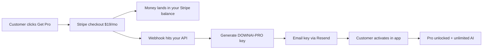

# DownAI — Launch & monetization guide

This is your playbook to start earning from DownAI.

## Product summary

- **Free**: Full editor, 10 AI chat messages per day, bring-your-own API key
- **Pro ($19/mo)**: Unlimited AI, priority support, license key activation

Revenue model: subscription → email license key → customer activates in app.

---

## Phase 1 — Ship (today)

### 1. Build & host

```bash
npm install
npm run icons
npm run build:exe
npm run website:build
```

- Copy installer to `packages/meridian-website/public/downloads/DownAI-Setup-1.0.0.exe`
- Re-run `npm run website:build`
- Deploy `packages/meridian-website/dist` to your host

### 2. Domain & email

- Register a domain (e.g. **downai.dev**, **getdownai.dev**, **usedownai.dev**)
- Set up **support@yourdomain.com** (Google Workspace, Zoho, or forwarding)
- Update email addresses in `index.html`, `privacy.html`, `terms.html`

### 3. Payments (pick one)

| Provider | Pros | Setup |
|----------|------|-------|
| **Stripe Payment Link** | Professional, recurring | Dashboard → Payment Links → $19/mo subscription |
| **Lemon Squeezy** | Handles tax/VAT | Product + license delivery webhook |
| **Gumroad** | Fastest to start | Create product, manual key email |

**Minimum viable:** Stripe Payment Link + manual key email after each sale.

1. Create Stripe account → Products → DownAI Pro → $19/month recurring
2. Create Payment Link
3. Paste URL into `packages/meridian-website/index.html` (`#buy-pro` link)
4. Stripe emails you on each sale → run `node scripts/generate-license.mjs 1` → reply with the key

### 4. Legal (already stubbed)

- Review and customize `packages/meridian-website/public/privacy.html` and `terms.html`
- Add your legal entity name if you have one

---

## Phase 2 — First customers

### Where to launch

1. **Product Hunt** — Tuesday–Thursday morning PT
2. **Hacker News** — Show HN post (honest, technical, not hype)
3. **Reddit** — r/programming, r/webdev, r/selfhosted (follow sub rules)
4. **Twitter/X** — demo GIF, link to download
5. **Indie Hackers** — build-in-public thread

### Messaging (not AI-slop)

- "Native Windows code editor. Monaco + projects + chat. Free download."
- "Like a focused desktop editor — no Electron-in-a-browser-tab feel."
- Avoid: "revolutionary AI-powered", "supercharge your workflow"

### Demo assets

- 30s screen recording: open folder → edit → chat → save
- Screenshot of welcome screen + editor with dark theme

---

## When someone pays (how you earn money)



### Step by step

1. **You set up Stripe** (one time)
   - [Stripe Dashboard](https://dashboard.stripe.com) → Products → **DownAI Pro** → **$19/month** recurring
   - Create a **Payment Link** → set **After payment** redirect to `https://yourdomain.com/success.html`
   - Paste the Payment Link URL into `packages/meridian-website/index.html` (replace `test_REPLACE_ME`)

2. **Customer pays**
   - Stripe charges their card **$19/month**
   - **You receive** the money in your Stripe balance (minus ~2.9% + 30¢ per charge)
   - Stripe pays out to your bank on your payout schedule (usually weekly)

3. **License is issued automatically** (after you deploy the API + webhook)
   - Deploy `packages/prism-api` (Railway, Fly.io, etc.)
   - Stripe → Developers → Webhooks → add endpoint: `https://api.yourdomain.com/webhooks/stripe`
   - Event: `checkout.session.completed`
   - Copy signing secret → `STRIPE_WEBHOOK_SECRET` in API env
   - Optional: `RESEND_API_KEY` + `DOWNAI_EMAIL_FROM` to email the key instantly

4. **Customer activates**
   - They paste the key in DownAI → Settings → Activate Pro
   - App validates offline (HMAC) — no phone-home required for activation
   - Hosted AI proxy also accepts the same key for unlimited messages

### Manual fallback (before automation)

Stripe emails you on each sale → run:

```bash
node scripts/generate-license.mjs 1
```

Reply to the customer with the key (see support macro below).

---

## Phase 4 — Grow revenue

| Lever | Action |
|-------|--------|
| Annual plan | $149/yr (2 months free) — new key format or longer expiry |
| Team plan | $15/seat/mo — volume keys |
| Lifetime | $199 one-time — higher expMonths in generator |
| Affiliate | 20% via Lemon Squeezy / Rewardful |

---

## Operations checklist

- [ ] Installer built and downloadable
- [ ] Stripe (or Gumroad) live
- [ ] Support email working
- [ ] 5 test license keys generated and one activated in app
- [ ] Privacy + Terms reviewed
- [ ] Domain + HTTPS on marketing site
- [ ] Refund policy documented (14-day in terms.html)

---

## Security notes

- **SECRET** in `scripts/generate-license.mjs` and `electron/license.ts` must match
- Never publish the generator script publicly with the secret
- Rotate secret + invalidate old keys if leaked (requires app update)
- API keys are stored locally in userData — consider OS keychain in v1.1

---

## Support macros

**Activation:**

> Thanks for subscribing to DownAI Pro. Your license key:
>
> `FDRY-PRO-XXXX-XXXX-XXXXXXXX`
>
> In DownAI: Settings → Plan → Activate license (or Ctrl+Shift+P → "Activate License").

**Refund:**

> Processed. Your license has been deactivated on our side; please remove it in Settings → Deactivate if still active.

---

## Metrics to track

- Downloads (installer clicks)
- Free → Pro conversion (manual until analytics added)
- Daily AI usage on free tier (aggregate later via opt-in telemetry)
- Support tickets / common issues

Good luck — ship it, get one paying customer, then iterate.
